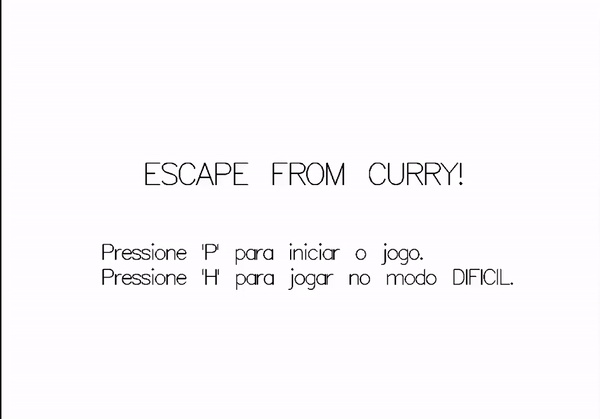
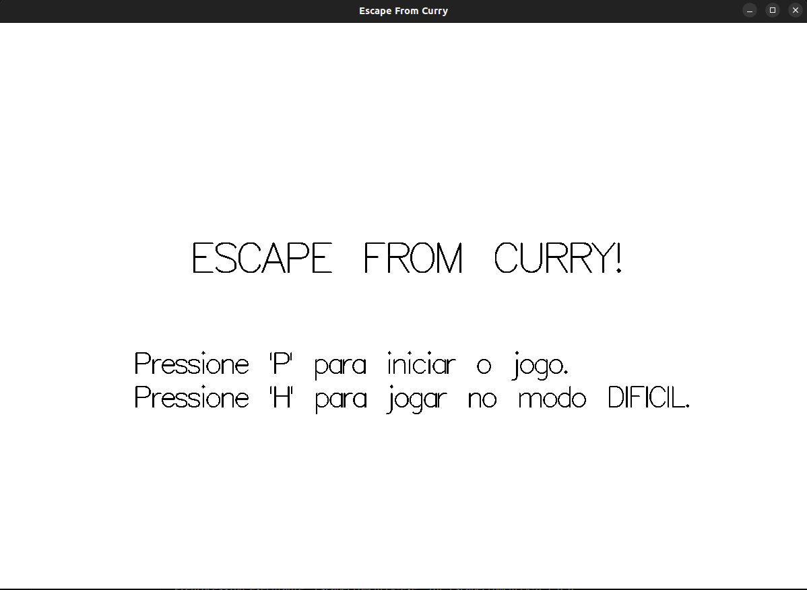
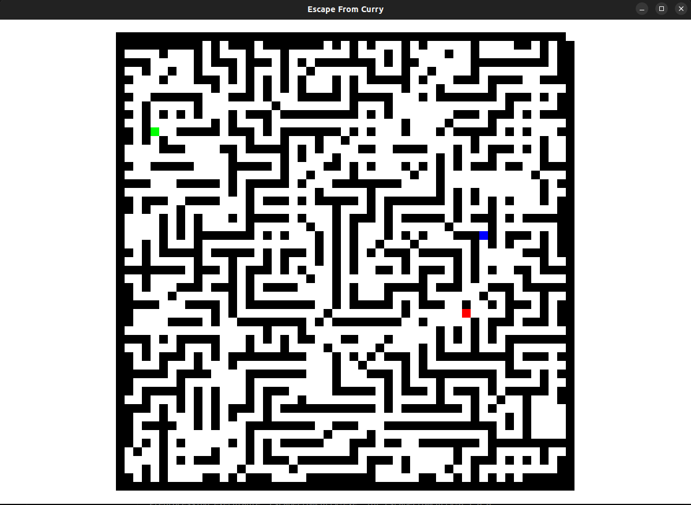
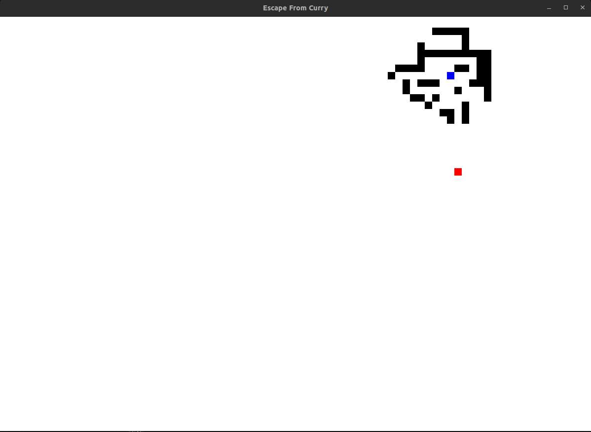
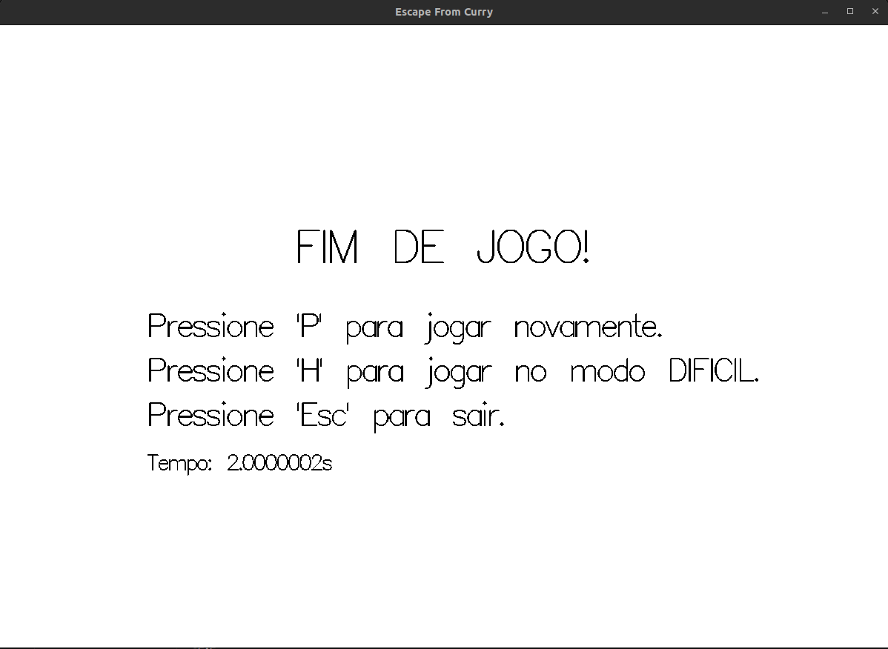
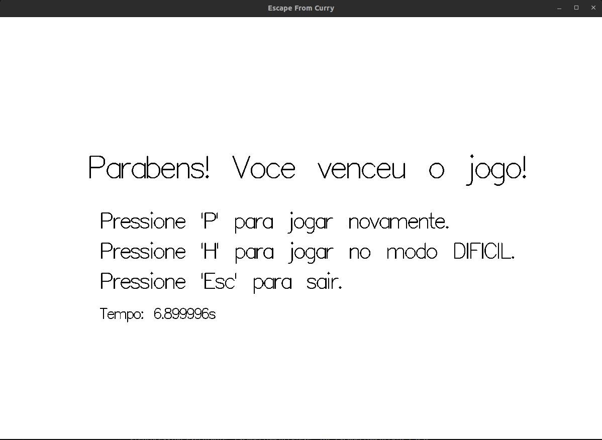

# EscapeFromCurry

**Disciplina**: FGA0210 - PARADIGMAS DE PROGRAMAÇÃO - T01 <br>
**Nro do Grupo**: 02<br>
**Paradigma**: Funcional<br>

# Jogo Rodando

## Alunos
|Matrícula | Aluno |
| -- | -- |
| 20/0013181 | Adne Moretti Moreira |
| 20/0057227 | Caio Vitor Carneiro de Oliveira |
| 19/0085819 | Cícero Barrozo Fernandes Filho |
| 19/0026758 | Deivid Alves de Carvalho |
| 19/0045817 | Gabriel Costa de Oliveira |
| 20/0018205 | Gabriel Moretti de Souza |
| 20/0019015 | Guilherme Puida Moreira |
| 20/0067923 | João Henrique Marques Calzavara |
| 20/2023903 | Lucas Lopes Rocha |

## Sobre 
&emsp;&emsp;Neste projeto, propomos a criação de um jogo de labirinto usando linguagem funcional para a disciplina de Paradigmas de Software. O jogo apresenta um jogador (caracter) e um monstro, onde o objetivo é alcançar a saída antes de ser capturado pelo monstro. Adotando o paradigma funcional, focaremos em funções puras para a movimentação do jogador e estratégias do monstro, além de utilizar o algoritmo de busca em largura (BFS) para encontrar a posição que o monstro deve se mover. A estrutura bidimensional do labirinto, representada por um grafo, será manipulada de forma imutável, promovendo legibilidade, facilidade de testes e prevenção de efeitos colaterais. Ao aplicar esses conceitos, buscamos destacar a eficácia e a elegância da programação funcional na construção de jogos, consolidando o aprendizado em paradigmas de software.

## Screenshots






## Instalação 
**Linguagens**: Haskell<br>
**Tecnologias**: GHCI, Cabal e Stack <br>

### Pré-requisitos

- **Haskell, GHCI e Stack:** essas ferramentas podem ser instaladas a partir dos links disponíveis na documentação oficial do Haskell ([ACESSO](https://www.haskell.org/downloads/)).
    - **OBS.:** ao executar o programa, caso dê erro, certifique-se de que o OpenGL está instalado corretamente.

## Uso 

1. Clone o repositório:

```bash
git clone https://github.com/UnBParadigmas2023-2/2023.2_G2_Funcional_EscapeFromCurry
```

1. Acesse o repositório:

```bash
cd 2023.2_G2_Funcional_EscapeFromCurry
```

3. Execute

```bash
stack build && stack exec EscapeFromCurry-exe
```

Após rodar os comandos de build e execução do projeto, abriá uma janela com o labirinto, para mexer o jogador, que é o ícone azul, basta movimentar pelas setas do teclado. O objetivo do jogo é alcançar o Goal, que está representado pela cor verde. Divirta-se! 

## Vídeo
Adicione 1 ou mais vídeos com a execução do projeto.
Procure: 
(i) Introduzir o projeto;
(ii) Mostrar passo a passo o código, explicando-o, e deixando claro o que é de terceiros, e o que é contribuição real da equipe;
(iii) Apresentar particularidades do Paradigma, da Linguagem, e das Tecnologias, e
(iV) Apresentar lições aprendidas, contribuições, pendências, e ideias para trabalhos futuros.
OBS: TODOS DEVEM PARTICIPAR, CONFERINDO PONTOS DE VISTA.
TEMPO: +/- 15min

## Participações
Apresente, brevemente, como cada membro do grupo contribuiu para o projeto.
|Nome do Membro | Contribuição | Significância da Contribuição para o Projeto (Excelente/Boa/Regular/Ruim/Nula) |
| -- | -- | -- |
| Adne Moretti Moreira | Módulo do monstro e auxílio na integração entre os módulos. | Excelente |
| Caio Vitor Carneiro de Oliveira | Módulo de criação de parede no Gloss e ajuda na integração final. | Excelente |
| Cícero Barrozo Fernandes Filho | Funções de validação da movimentação do player e ajuda nas integrações finais. | Excelente |
| Deivid Alves de Carvalho | --- | --- |
| Gabriel Costa de Oliveira | Estrutura do stack no módulo do mostro e integração entre os módulos  | Excelente |
| Gabriel Moretti de Souza | Início do Types.hs, movimentação do player e integrações finais. | Excelente |
| Guilherme Puida Moreira | Geração de mapa, implementação do modo difícil, integração entre módulos e ajuda para outros integrantes do grupo. | Excelente |
| João Henrique Marques Calzavara | Módulos Time e Game, integrações finais e README. | Excelente |
| Lucas Lopes Rocha | Módulos Time e Game, integrações finais e README. | Excelente |

## Outros 

### Lições Aprendidas
- **Paradigma Funcional:** A principal lição aprendida foi a compreensão e aplicação do paradigma funcional na programação de jogos. Usar Haskell como linguagem principal nos permitiu criar funções puras para a movimentação do jogador e estratégias do monstro, enfatizando a imutabilidade dos dados e evitando efeitos colaterais.
- **Algoritmo de Busca em Largura (BFS):** A implementação do algoritmo BFS para determinar a movimentação do monstro no labirinto foi uma valiosa lição. Ele mostrou como algoritmos de busca podem ser poderosos em jogos e como a escolha adequada do algoritmo afeta o comportamento do jogo.
- **Tipagem Estática em Haskell:** A natureza estática e forte da tipagem em Haskell trouxe benefícios significativos. Erros de tipos foram detectados em tempo de compilação, o que facilitou a depuração e melhorou a robustez do código.
- **Colaboração em Equipe:** A colaboração em equipe no desenvolvimento do jogo destacou a importância de manter as branches atualizadas com a master. A comunicação constante e a resolução de conflitos de forma eficaz foram lições cruciais para um desenvolvimento suave.

### Contribuições
- Implementamos com sucesso a movimentação do jogador, o monstro e a lógica do jogo, demonstrando a aplicação dos conceitos aprendidos.
- O uso do algoritmo BFS para o monstro tornou a perseguição mais desafiadora e estratégica.
- Criamos um jogo funcional e sólido que cumpriu os objetivos do projeto.

### Fragilidades
- A principal fragilidade que enfrentamos durante o desenvolvimento foi a restrição de tempo. O cronograma apertado nos limitou na criação de novas funcionalidades e na expansão do jogo de acordo com nossas ambições iniciais. O desejo de adicionar recursos adicionais esbarrou na falta de tempo para implementá-los adequadamente.

### Melhorias Futuras ao Trabalho
- **Novos Algoritmos de Busca para Monstros:** Para tornar o jogo ainda mais desafiador, planejamos implementar outros tipos de monstros com algoritmos de busca diferentes. Cada monstro terá estratégias únicas de perseguição, adicionando variedade e complexidade ao jogo.
- **Poderes Especiais para o Jogador:** Estamos interessados em adicionar poderes especiais ao jogador, como habilidades temporárias de invulnerabilidade, velocidade aumentada ou capacidade de mover obstáculos temporariamente. Esses poderes darão ao jogador mais opções estratégicas para enfrentar o monstro.
- **Melhoria da Interface de Usuário:** Reconhecemos a importância da interface de usuário (UI) para a experiência do jogador. Planejamos aprimorar a interface, tornando-a mais amigável, atraente e informativa, a fim de proporcionar uma experiência de jogo mais envolvente.
- **Recursos de Pontuação e Modos de Jogo:** Adicionar diferentes valores de pontuação para moedas coletadas e explorar novos modos de jogo para manter o interesse dos jogadores.

## Fontes
- Inspirado em: https://github.com/UnBParadigmas2022-1/2022.1_G3_Funcional_ProjetoPacman;
- Baseado em: https://github.com/GameJamFGA-UnB/Escape-From-Dijkstra;

> Downloads.  Disponível em: <https://www.haskell.org/downloads/>. Acesso em: 21 set. 2023.

> CONTRIBUTORS, S. The Haskell Tool Stack.  Disponível em: <https://docs.haskellstack.org/en/stable/>. Acesso em: 21 set. 2023.

> gloss: Painless 2D vector graphics, animations and simulations..  Disponível em: <https://hackage.haskell.org/package/gloss>. Acesso em: 21 set. 2023.


